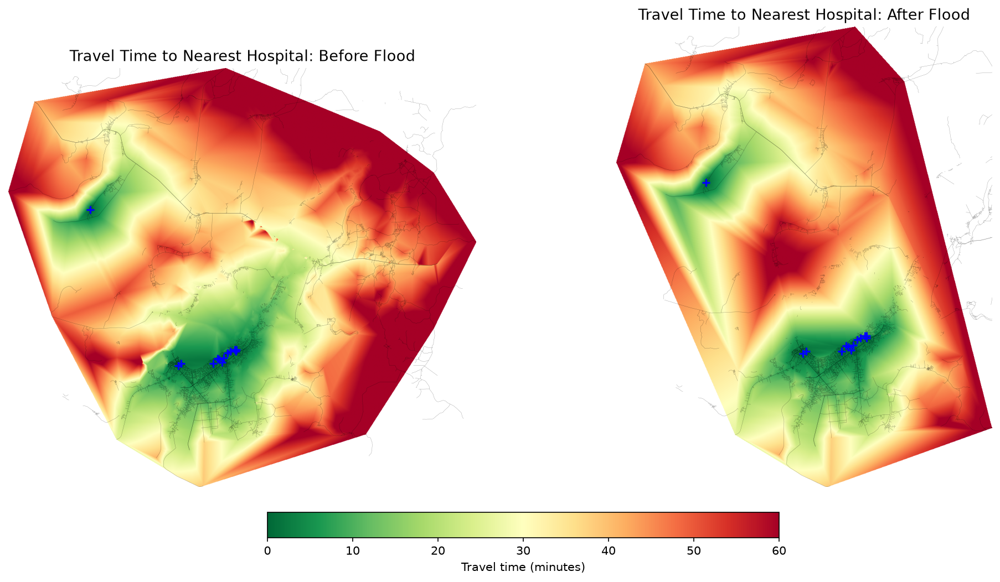
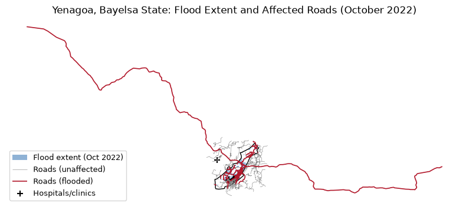
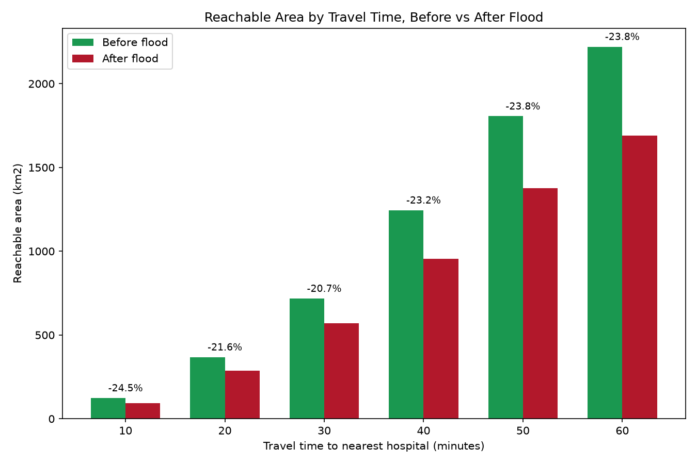

# Flood Disrupted Healthcare Access, Yenagoa, Bayelsa State (2022)



Network accessibility analysis measuring how the October 2022 Nigeria floods
disrupted travel time to the nearest hospital in Yenagoa, Bayelsa State,
Niger Delta.

## Data

- Flood extent: UNOSAT satellite detected water extent (VIIRS), Oct 1-25 2022
  cumulative window, via Humanitarian Data Exchange
- Road network: OpenStreetMap, 4,983 segments
- Health facilities: OpenStreetMap, 13 hospitals/clinics
- Study area boundary: FAO GAUL 2025 (Yenegoa LGA, Bayelsa State)

## Method

1. Clipped national flood extent to Yenagoa boundary
2. Identified road segments intersecting the flood extent
3. Assigned realistic travel speeds by road classification
4. Computed network based travel time to nearest hospital using QGIS/QNEAT3
   iso-area analysis, once on the intact network, once with flooded
   segments removed
5. Compared reachable area at 10 minute intervals up to 60 minutes



## Key findings

- The flood intersected 768 of 4,983 road segments (15.4% by count), but
  those segments accounted for 36.3% of total road length (3,158 km down
  to 2,010 km), meaning longer arterial roads were disproportionately cut.
- Area reachable within every travel time band fell by a consistent 20-24%
  after the flood: from 123.6 km2 to 93.4 km2 within 10 minutes (-24.4%),
  and from 2,220.7 km2 to 1,691.3 km2 within 60 minutes (-23.8%).
- The consistency of that percentage across all time bands indicates the
  flood degraded access proportionally system wide, not just in one
  travel distance range.



## Limitations

- OpenStreetMap road and facility coverage in Nigeria varies by area;
  results reflect what is mapped, not necessarily every real facility or road.
- Travel speeds are assigned by road classification defaults, not measured
  traffic data.
- Analysis reflects one specific flood extent product; actual road closure
  timing and duration during the real event may have differed.

## Reproducing this analysis

```bash
python3 get_bayelsa_boundary.py
python3 compare_flood_windows.py
python3 find_flooded_roads.py
python3 add_travel_time.py
python3 prepare_for_qneat3.py
# then run the two qgis_process qneat3:isoareaaspolygonsfromlayer commands, see project notes
python3 compare_accessibility_raster.py
python3 visualize_accessibility.py
python3 visualize_flooded_roads.py
python3 chart_accessibility.py
```

Requires QGIS with the QNEAT3 plugin, and Python packages: geopandas,
rasterio, numpy, matplotlib.
